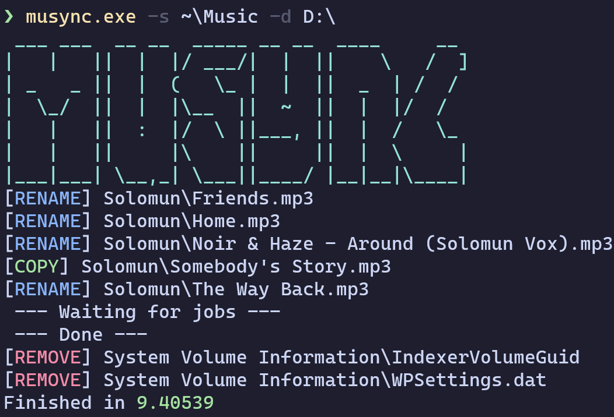

# `musync`

A tool which lets you listen to your lossless music collection on your car radio.

 

## Why?

The radio in my car is ancient and can only play MP3 files. All of the music in my
collection is lossless (FLAC, WAV). musync will convert all of the music to MP3 and copy
it over to my flash drive. Running musync again will only copy or convert new music.
Renamed/moved files are detected and are not converted again.

I organize my music into folder by artist and albums. But this means that I have a deep
structure of folders. The radio allows me to randomly play music from a folder, but it
doesn't look into subfolders, so musync flattens the directory structure upto a single
level. This means that I lose some of the organization but I can play one folder and
skip my way to the songs I want to listen to.

## Installation

Requires the following programs:

 - `ffmpeg`: [https://www.ffmpeg.org/](https://www.ffmpeg.org/)

```shell
git clone https://github.com/aspizu/musync
cd musync
cargo install --path .
```

## Usage

```
Usage: musync.exe [OPTIONS] -s <SRC> -d <DST>

Options:
  -s <SRC>                 Directory to sync from
  -d <DST>                 Directory to sync to
  -j <JOBS>                Number of jobs to run in parallel [default: 16]
  -b, --bitrate <BITRATE>  Bitrate of converted files [default: 256]
  -h, --help               Print help
  -V, --version            Print version
```

## Example

Sync music from your `Music` directory to your flash drive mounted at `D:\`.

```powershell
musync.exe -s ~\Music -d D:\
```

Sync music from `~/Music` to your flash drive mounted at `/run/media/aspizu/USB`.

```shell
musync -s ~/Music -d /run/media/aspizu/USB
```

Run the above command again when you update your music collection.

## Contributing

Pull requests are welcome.
