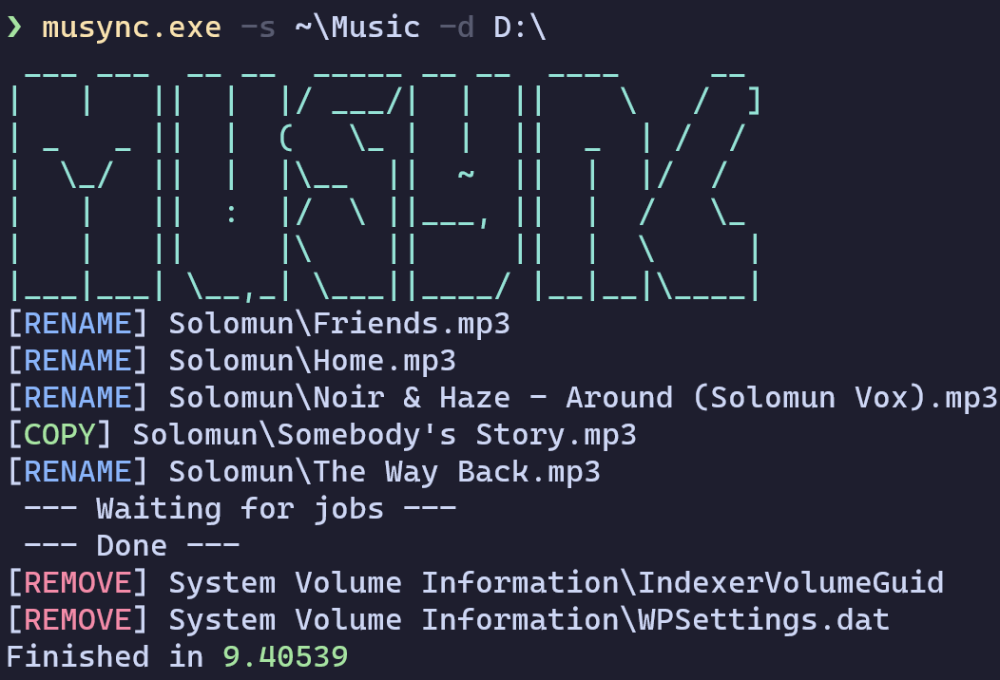

# `musync`

A tool which lets you listen to your lossless music collection on your car radio.



## Why?

The radio in my car is ancient and can only play MP3s.  All music in my collection
is lossless (FLAC, WAV, AIFF, ...).  musync converts music to MP3s and copies to
my flash drive. Running musync again will only convert/copy new music. Renamed files
are not converted again.

My music collection is categorized into folder by artist and albums.  Resulting in a deep
nested directory structure.  The radio allows me to shuffle music from a folder, but it
doesn't look into sub-folders.  musync flattens the directory structure upto a single
level. This means that I lose some of the categorization but I can play one folder on shuffle and
skip my way to the songs I want to listen to.

## Installation

Requirements:

-   `ffmpeg`: [https://www.ffmpeg.org/](https://www.ffmpeg.org/)

### From source

```shell
git clone https://github.com/aspizu/musync
cd musync
cargo install --path .
```

### From source (using cargo only)

```shell
cargo install --git https://github.com/aspizu/musync
```

## Usage

```
Usage: musync.exe [OPTIONS] -s <SRC> -d <DST>

Options:
  -s <SRC>                       Directory to sync from
  -d <DST>                       Directory to sync to
  -j <JOBS>                      Number of jobs to run in parallel [default: 16]
  -b, --bitrate <BITRATE>        Bitrate of converted files [default: 256]
  -s, --samplerate <SAMPLERATE>  Sample rate of converted files [default: 44100]
  -h, --help                     Print help
  -V, --version                  Print version
```

## Example

Sync music from your `Music` directory to your flash drive mounted at `D:\`.

```powershell
musync.exe -s ~\Music -d D:\
```

Sync music from `~/Music` to your flash drive mounted at `/run/media/aspizu/USB`.

```shell
musync -s ~/Music -d /run/media/aspizu/USB
```

Run the above command again when you update your music collection.

## Contributing

Pull requests are welcome.
